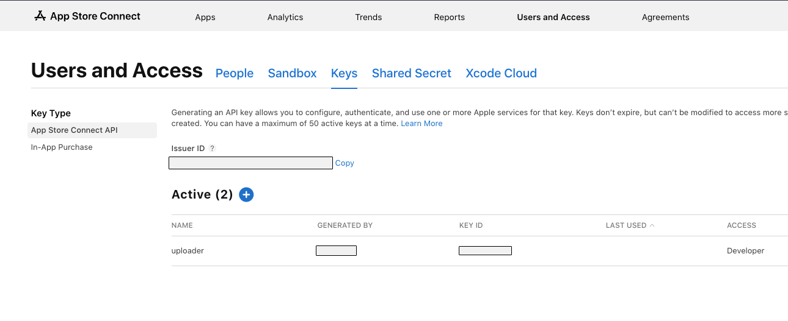

# Uploader

[](https://pub.dev/packages/uploader)

This package is used for creating AAB/APK and IPA files, and sending them to Play Console, TestFlight, and Firebase App Distribution

# Installation

### IOS

- Create a JSON file with `issuer_id` and `auth_key`, and provide the path of the JSON file to the `Uploader`'s `testFlightConfig->path` parameter.
- issuer_id can be obtained in `Users and Access` under `App Store Connect`.
- For `auth_key`, create a new `Developer Key` in the same section as `issuer_id`. The id value of this key can be used as the `auth_key`. Download the created key file and place it in the `~/private_keys/` directory on the computer where the package will be called.



### ANDROID

- Configure the `keystore` (https://developer.android.com/studio/publish/app-signing#secure-shared-keystore).
- Activate the `Google Play Android Developer API` on `Google Cloud ` (https://console.developers.google.com/apis/api/androidpublisher.googleapis.com/?hl=en).
- Create a `service account` from this link: https://console.cloud.google.com/iam-admin/serviceaccounts?hl=en. After creating the `service account` , generate a new `JSON` `Key` file from the `Keys` tab of the `service account` . Provide the path of this JSON file to the `Uploader` 's `playStoreConfigPath->path` parameter.
- Finally, the service account needs to be granted permission. From the ` Users and Permissions` section of the `Google Play Console` , send an invitation to the `service account` email with `Admin` or `Releases` permissions.

### FIREBASE APP DISTRIBUTION

- Install `Firebase CLI` (https://firebase.google.com/docs/cli?hl=tr).
- Activate `App Distribution` on `Firebase` .
- Under Settings in `Firebase` , integrate with `Google Play` in the `Integrations` tab. If the app has not been published yet, this integration cannot be done, and in this case, `Uploader` 's `androidBuildType` parameter should be set to `apk` .

# Usage

```yaml
dev_dependencies:
  uploader: any
```

```yaml
uploader:
  platform: all # ios, android, all
  uploadType: all # appDistribution, store, all
  testFlightConfig:
    path: ios_deploy_config.json # must include auth_key and issuer_id
  playStoreConfigPath:
    path: android_deploy_config.json # must include client_email, client_id, private_key
    track: internal # internal, alpha, beta
    packageName: "com.package.name"
    skslPath: null
  appDistributionConfig:
    androidBuildType: abb # abb, apk
    androidTestersPath: android/testers.txt
    iosTestersPath: ios/testers.txt
    releaseNotesPath: release_notes.txt
    useParallelUpload: true # default:true
    enableLogFileCreation: false # default: false.
  extraBuildParameters: null
```

# Collaborators

<a href="https://github.com/emircetn/uploader/graphs/contributors">
  
</a>
