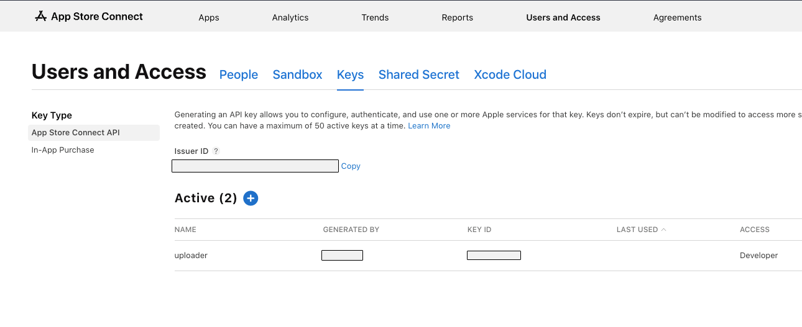

# Uploader

[](https://pub.dev/packages/uploader)

This package is used for creating AAB/APK and IPA files, and sending them to Play Console, TestFlight, and Firebase App Distribution

# Installation

### IOS

- Create a JSON file with `issuer_id` and `auth_key`, and provide the path of the JSON file to the `Uploader`'s `testFlightConfig->path` parameter.
- issuer_id can be obtained in `Users and Access` under `App Store Connect`.
- For `auth_key`, create a new `Developer Key` in the same section as `issuer_id`. The id value of this key can be used as the `auth_key`. Download the created key file and place it in the `~/private_keys/` directory on the computer where the package will be called.



### ANDROID

- Configure the `keystore` (https://developer.android.com/studio/publish/app-signing#secure-shared-keystore).
- Activate the `Google Play Android Developer API` on `Google Cloud ` (https://console.developers.google.com/apis/api/androidpublisher.googleapis.com/?hl=en).
- Create a `service account` from this link: https://console.cloud.google.com/iam-admin/serviceaccounts?hl=en. After creating the `service account` , generate a new `JSON` `Key` file from the `Keys` tab of the `service account` . Provide the path of this JSON file to the `Uploader` 's `playStoreConfig->path` parameter.
- Finally, the service account needs to be granted permission. From the ` Users and Permissions` section of the `Google Play Console` , send an invitation to the `service account` email with `Admin` or `Releases` permissions.

### FIREBASE APP DISTRIBUTION

- Install `Firebase CLI` (https://firebase.google.com/docs/cli?hl=tr).
- Activate `App Distribution` on `Firebase` .
- Under Settings in `Firebase` , integrate with `Google Play` in the `Integrations` tab. If the app has not been published yet, this integration cannot be done, and in this case, `Uploader` 's `androidBuildType` parameter should be set to `apk` .

# Usage

```yaml
dev_dependencies:
  uploader: any
```

```sh
dart run uploader              # asks for confirmation before it starts
dart run uploader --yes        # no prompt, for CI
dart run uploader --dry-run    # prints every command without running any
dart run uploader --help
```

The process exits with a non-zero status when anything fails, so it can be
used as a CI step directly.

## Configuration

```yaml
uploader:
  platform: all # ios, android, all
  uploadType: all # appDistribution, store, all
  testFlightConfig:
    path: ios_deploy_config.json # must include auth_key and issuer_id
  playStoreConfig:
    path: android_deploy_config.json # must include client_email, client_id, private_key
    track: internal # internal, alpha, beta
    releaseStatus: completed # completed, draft. default: completed
    skslPath: null
  appDistributionConfig:
    androidBuildType: abb # abb, apk
    androidTesters:
      path: android/testers.txt
    iosTesters:
      url: https://testers.txt
    androidGroups: # Firebase App Distribution group aliases
      - qa
    iosGroups:
      - qa
    releaseNotesPath: release_notes.txt
  useParallelUpload: true # default: true
  uploadRetryCount: 2 # extra attempts per upload step. default: 2
  enableLogFileCreation: false # default: false
  extraBuildParameters: null
```

### Build parameters

`extraBuildParameters` is appended to every `flutter build` the run performs.
Two optional lists narrow that down to a single target:

```yaml
uploader:
  extraBuildParameters: # every build
    - --no-tree-shake-icons
  appDistributionExtraBuildParameters: # App Distribution builds only
    - --dart-define=APP_CHANNEL=staging
  storeExtraBuildParameters: [] # store builds only
```

A build receives the common list followed by its own target's list. Writing
none of these keys behaves exactly as before.

This works because a run builds each target separately, so the two never share
an artifact:

| | App Distribution build | Store build |
|---|---|---|
| iOS | `flutter build ipa --export-method=ad-hoc` | `flutter build ipa --export-method=app-store` |
| Android, `androidBuildType: apk` | `flutter build apk` | `flutter build appbundle` |
| Android, `androidBuildType: abb` | `flutter build appbundle` | `flutter build appbundle` |

With `uploadType: all` in `abb` mode that means two app bundles are produced.
The cost is one extra build; the gain is that a diagnostic `--dart-define`
meant for testers never reaches the binary that goes to the store.

The confirmation screen prints the resolved list for each target before
anything is built, so a flag written to the wrong list is visible up front.

Production releases are deliberately out of scope: the tool publishes to the
test tracks and the production rollout stays a Play Console decision.

Only `platform` and `uploadType` are required. Every other key falls back to
the default shown above.


# Collaborators

<a href="https://github.com/emircetn/uploader/graphs/contributors">
  
</a>
