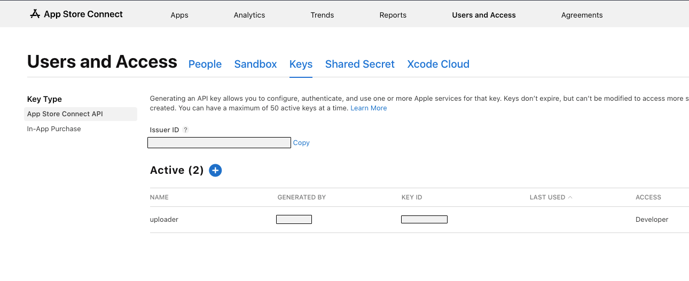

# Uploader

[](https://pub.dev/packages/uploader)

This package is used for creating AAB/APK and IPA files, and sending them to Play Console, TestFlight, and Firebase App Distribution

# Installation

### IOS

- Create a JSON file with `issuer_id` and `auth_key`, and provide the path of the JSON file to the `Uploader`'s `testFlightConfig->path` parameter.
- issuer_id can be obtained in `Users and Access` under `App Store Connect`.
- For `auth_key`, create a new `Developer Key` in the same section as `issuer_id`. The id value of this key can be used as the `auth_key`. Download the created key file and place it in the `~/private_keys/` directory on the computer where the package will be called.



### ANDROID

- Configure the `keystore` (https://developer.android.com/studio/publish/app-signing#secure-shared-keystore).
- Activate the `Google Play Android Developer API` on `Google Cloud ` (https://console.developers.google.com/apis/api/androidpublisher.googleapis.com/?hl=en).
- Create a `service account` from this link: https://console.cloud.google.com/iam-admin/serviceaccounts?hl=en. After creating the `service account` , generate a new `JSON` `Key` file from the `Keys` tab of the `service account` . Provide the path of this JSON file to the `Uploader` 's `playStoreConfig->path` parameter.
- Finally, the service account needs to be granted permission. From the ` Users and Permissions` section of the `Google Play Console` , send an invitation to the `service account` email with `Admin` or `Releases` permissions.

### FIREBASE APP DISTRIBUTION

- Install `Firebase CLI` (https://firebase.google.com/docs/cli?hl=tr).
- Activate `App Distribution` on `Firebase` .
- Under Settings in `Firebase` , integrate with `Google Play` in the `Integrations` tab. If the app has not been published yet, this integration cannot be done, and in this case, `Uploader` 's `androidBuildType` parameter should be set to `apk` .

# Usage

```yaml
dev_dependencies:
  uploader: any
```

```sh
dart run uploader              # asks for confirmation before it starts
dart run uploader --yes        # no prompt, for CI
dart run uploader --dry-run    # prints every command without running any
dart run uploader --audit      # reports which plugins the Dart code reaches, uploads nothing
dart run uploader --upload-symbols # retries archived symbol uploads that failed
dart run uploader --help
```

The process exits with a non-zero status when anything fails, so it can be
used as a CI step directly.

## Configuration

```yaml
uploader:
  platform: all # ios, android, all
  uploadType: all # appDistribution, store, all
  testFlightConfig:
    path: ios_deploy_config.json # must include auth_key and issuer_id
  playStoreConfig:
    path: android_deploy_config.json # must include client_email, client_id, private_key
    track: internal # internal, alpha, beta
    releaseStatus: completed # completed, draft. default: completed
    skslPath: null
  appDistributionConfig:
    androidBuildType: abb # abb, apk
    androidTesters:
      path: android/testers.txt
    iosTesters:
      url: https://testers.txt
    androidGroups: # Firebase App Distribution group aliases
      - qa
    iosGroups:
      - qa
    releaseNotesPath: release_notes.txt
  useParallelUpload: true # default: true
  uploadRetryCount: 2 # extra attempts per upload step. default: 2
  enableLogFileCreation: false # default: false
  extraBuildParameters: null
```

### Build parameters

`extraBuildParameters` is appended to every `flutter build` the run performs.
Two optional lists narrow that down to a single target:

```yaml
uploader:
  extraBuildParameters: # every build
    - --no-tree-shake-icons
  appDistributionExtraBuildParameters: # App Distribution builds only
    - --dart-define=APP_CHANNEL=staging
  storeExtraBuildParameters: [] # store builds only
```

A build receives the common list followed by its own target's list. Writing
none of these keys behaves exactly as before.

This works because a run builds each target separately, so the two never share
an artifact:

| | App Distribution build | Store build |
|---|---|---|
| iOS | `flutter build ipa --export-method=ad-hoc` | `flutter build ipa --export-method=app-store` |
| Android, `androidBuildType: apk` | `flutter build apk` | `flutter build appbundle` |
| Android, `androidBuildType: abb` | `flutter build appbundle` | `flutter build appbundle` |

With `uploadType: all` in `abb` mode that means two app bundles are produced.
The cost is one extra build; the gain is that a diagnostic `--dart-define`
meant for testers never reaches the binary that goes to the store.

### Build environment

Some switches are not `flutter build` flags but environment variables, such as
Flutter's `FLUTTER_XCODE_<SETTING>`, which becomes an Xcode build setting on
every target, pods included. Three optional maps mirror the parameter lists:

```yaml
uploader:
  extraBuildEnvironment: {} # every build
  appDistributionExtraBuildEnvironment: # App Distribution builds only
    FLUTTER_XCODE_STAGING: "YES"
  storeExtraBuildEnvironment: {} # store builds only
```

A build process inherits the shell's environment and gets the common map with
its own target's map on top; a target's value wins. Values are written as text:
a YAML `true` or `yes` becomes `YES`, a number its digits. `--dry-run` prints the
variables in front of each build command.

The confirmation screen prints the resolved list for each target before
anything is built, so a flag written to the wrong list is visible up front.

Production releases are deliberately out of scope: the tool publishes to the
test tracks and the production rollout stays a Play Console decision.

Only `platform` and `uploadType` are required. Every other key falls back to
the default shown above.

## iOS size check

After each IPA is built the run prints how large it is and compares that to the
App Store's 200 MB over-the-air download limit:

```
[INFO]
[ios] IPA payload is 177.9 MB, 22.1 MB under the 200 MB App Store limit
```

Within 15 MB of the limit the line becomes a `WARNING`, and over the limit an
`ERROR`. Both of those also list the fifteen largest items in the archive, so a
build that grew says what grew:

```
[ERROR]
[ios] IPA payload is 203.8 MB, 3.8 MB over the 200 MB App Store limit
     51.5 MB  Runner
     21.0 MB  Frameworks/media_kit_libs_ios_video.framework
     15.3 MB  Frameworks/App.framework
     10.1 MB  Frameworks/App.framework/flutter_assets/assets/images
     ...
```

The number is the uncompressed total of everything under `Payload/`, in decimal
MB. An IPA also carries `Signatures/` and `Symbols/`, which are not installed on
a device — counting the whole archive reads far larger than the app actually is.

Items are grouped at frameworks and resource bundles, because that is the unit
that gets added or removed. Flutter's assets are reported separately from
`App.framework` even though they ship inside it; otherwise an asset that grew
would look like the Dart snapshot growing.

`unzip` closes its listing with a totals row, and the run checks the entries it
read against it. That matters because the figure can only ever be too low: if a
line were skipped, an oversized build would otherwise be reported as a
comfortable one. When the two do not agree the size is presented as a lower
bound and the limit is reported as unresolved rather than cleared — an
oversized build still reads as oversized either way.

The check never stops a run. Whether an oversized build is still worth sending
to testers is a decision for whoever reads the warning, and failing here would
only strand an artifact that was built successfully.

It needs `unzip` on the `PATH`. With no archive on disk nothing is printed, so
`--dry-run` is unaffected; if the archive is there but cannot be read, the run
says the size was not checked instead of staying quiet.

## Crash symbols

A release build leaves behind what crash reporters need to make stack traces
readable: R8's `mapping.txt`, unstripped native libraries, the archive's
dSYMs and, with `--split-debug-info`, Dart symbols. They live in `build/`,
so the next build overwrites them. With `uploadType: all` that next build is
part of the same run: the App Distribution build's symbols are gone before
the store build has finished.

With a `symbols` section every build's symbols are copied out of `build/`
as soon as that build ends, and sent to each configured destination once the
run's App Distribution, TestFlight and Play Console uploads are done, so a
slow or failing crash reporter never holds back a release:

```yaml
uploader:
  symbols:
    archivePath: ~/.uploader/archive # default
    keepLast: 10 # runs kept per app. default: 10
    failOnUploadError: false # default: false
    crashlytics: true
    newRelic:
      region: us # us, eu, jp. default: us
      androidToken: # where the token is read from, never the token itself
        env: NEW_RELIC_ANDROID_KEY
      iosToken:
        file: .env
        key: NEW_RELIC_IOS_KEY
    commands: # any other reporter
      - name: sentry
        platform: android # android, ios, all. default: all
        run: sentry-cli upload-proguard {mapping}
```

`symbols: true` archives without uploading anywhere. Without a `symbols`
section a run behaves exactly as before. An unknown key under `symbols`, such
as a misspelt `crashlytic:`, stops the run before anything is built.

### Archive

```
~/.uploader/archive/<app>/<version+build>/<run>/<platform>-<target>/
  mapping.txt.zip
  crashlytics_mapping_file_id.xml.zip
  native-libs.zip
  dart-symbols.zip
  dSYMs.zip       # the .dSYM bundles at the zip's root
  manifest.json
```

The archive is outside the project by default so `flutter clean` cannot take
it. `archivePath` and a token `file` may start with `~`; a relative path is
read from the project root. `<version+build>` is the version the build was
given: `--build-name` and `--build-number` in the build parameters win over
`pubspec.yaml`, so a CI build number lands in a folder of its own. Each kind of file is compressed into a zip of its own; uploads extract
them to a temporary folder and remove that afterwards. `manifest.json` records
the version, git commit, Firebase app id, New Relic build id and the outcome
of each upload. If a build's symbols cannot be archived, the run stops before
the next build overwrites them. `zip` and `unzip` have to be on the `PATH`.

Android files are read from the variant the build produced: `release`, or
`prodRelease` for `--flavor prod`. A folder the build left empty is treated
as not produced. With `--split-debug-info`, each platform archives only its
own `app.<platform>-*.symbols` files, so a folder both platforms write to is
not mixed up between them.

Unstripped native libraries are large, which is why the archive is
compressed. For a mid-sized app with every ABI, an Android build's 850 MB of
mapping and native libraries became a 241 MB zip in about 20 seconds, and an
iOS build's 457 MB of dSYMs a 144 MB zip in about 12. The oldest runs beyond
`keepLast` are removed at the end of a run. A run with an upload still
pending outlives them, but only the newest `keepLast` such runs do, so an
upload that keeps failing, such as one whose token is only set on CI, cannot
grow the archive forever; removing a run with an upload still pending is
reported.

### Destinations

| | Android | iOS |
|---|---|---|
| `crashlytics` | `mapping.txt` with its mapping file id, native and Dart symbols, through the Firebase CLI, to the app id in `android/app/google-services.json` | dSYMs through `ios/Pods/FirebaseCrashlytics/upload-symbols`, to the app id in `ios/Runner/GoogleService-Info.plist`; Crashlytics reads Dart symbols from the dSYMs |
| `newRelic` | `mapping.txt`, tagged with the build's New Relic build id. Only with `androidToken` | the archived `dSYMs.zip` as it is, or in batches when it is over New Relic's 600 MB limit. Only with `iosToken` |
| `commands` | any command, with `{mapping}`, `{crashlyticsMappingId}`, `{nativeLibs}`, `{dartSymbols}`, `{dsyms}`, `{dir}`, `{version}`, `{buildNumber}`, `{platform}`, `{target}` and `{firebaseAppId}` replaced by quoted values | |

Uploads are retried `uploadRetryCount` times. One that still fails does not
fail the run: the binary has already been built, and its symbols are safe in
the archive. It is recorded as pending and printed with the command that
retries it. A run that stops between a build and its symbol uploads leaves
them pending too. Set `failOnUploadError: true` to stop the run instead. A New
Relic upload that stalls times out, after a minute plus the time the file
takes at 256 KB/s, and is retried like any other failure.

An upload is pending only while a retry can still succeed: a network error,
a token or Firebase app id not found yet, `pod install` not run. What can
never be sent is recorded as skipped with the reason, such as a mapping file
built without the Crashlytics Gradle plugin's mapping file id. Skipped
uploads do not keep a run from being removed.

New Relic only matches a crash to a mapping file tagged with the build id its
Gradle plugin compiles into the app. The run reads that id from the build and
uploads a tagged copy; a mapping file uploaded without it is accepted and
never used.

### Tokens

`pubspec.yaml` says where each New Relic token is read from, so whoever reads
the configuration can see which data an upload uses; the token itself never
goes in it. A source is one of:

```yaml
androidToken:
  env: NEW_RELIC_ANDROID_KEY # an environment variable, such as a CI secret
iosToken:
  file: dart_defines/prod.json # a JSON object or KEY=value lines
  key: NEW_RELIC_IOS_KEY # (.env, newrelic.properties)
```

Nothing else is searched. A platform without a token source is not uploaded
to New Relic, and a token that is not where its source says leaves the upload
pending with that source named. The confirmation screen lists each source,
and whether the token is there, before anything is built; the token itself
is never printed.

### Retrying

```sh
dart run uploader --upload-symbols
```

retries every pending upload in the archive. Nothing is built, so it needs
neither store credentials nor the project's build output; it does need what
the uploads themselves use: the Firebase CLI signed in, the tokens where
their sources say, and for iOS Crashlytics `ios/Pods/FirebaseCrashlytics/upload-symbols`.
A build whose Firebase app id could not be read is read again from
`google-services.json` or `GoogleService-Info.plist`. A pending upload whose
destination has since been removed from `symbols` is marked skipped.
`--dry-run` lists what it would send.

## Trimming plugins and assets

Flutter tree-shakes Dart code nobody calls, but not native code: every plugin
in `pubspec.lock` is registered and its pods, AARs, frameworks and manifest
permissions are built into the app, called or not. The same holds for the
assets a package declares. An app that depends on a large kit ships all of it.

```yaml
uploader:
  pluginStubs: # native side left out of the builds
    auto: true # also every plugin the analysis finds unused
    keep: # never stubbed by auto
      - google_mobile_ads
    all:
      - google_sign_in
      - workmanager
    ios: # still built on Android
      - media_kit_libs_ios_video
    android: []
  prunedAssets: # glob patterns, relative to each package's root
    paywall_kit:
      - assets/videos/**
  prunedFonts: # font families each package declares
    phosphor_flutter:
      - PhosphorThin
  allowedPluginsPath: tool/allowed_plugins.yaml
  verifyPluginStubs: true # default: true
```

### Plugin stubs

Before building, a run copies each listed package from the pub cache into
`build/uploader/plugin_stubs/`, removes its native folders and its
`flutter: plugin:` declaration for the listed platforms, and points
`dependency_overrides` at the copy through a generated `pubspec_overrides.yaml`.
The Dart API stays exactly as it is, so every package that imports it still
compiles; Flutter just no longer sees a plugin. Federated implementations
(`google_sign_in_ios`, `google_sign_in_android`) leave the graph with it, so
listing the app-facing package is enough. An implementation only a platform
uploader does not build shares, such as `shared_preferences_foundation` for
iOS and macOS, leaves too. One both Android and iOS use stays while the other
platform still builds it, and the run stops until it is stubbed as well.
Symbolic links in a package, such as `ios/Classes` pointing at
`../darwin/Classes`, are copied as links.

The copy is made from whatever version `pubspec.lock` resolves on every run,
so an update of the package needs nothing from you. When the builds finish, or
the run fails or is interrupted, `pubspec_overrides.yaml`, `pubspec.lock`, the
`Podfile.lock` and the stub folders are put back. Nothing is committed. A run
that ends up stubbing nothing keeps what its builds changed in those files, as
a plain build would. A run killed outright, without a signal to restore on, is
restored by the next run; a lockfile changed after it was killed, by a
`pub upgrade` or `pod update` for instance, is left as it is and reported.

Pub workspace members (`resolution: workspace`) are not supported yet: their
lockfile, package config and overrides live in the workspace root, so a run
with stubs, pruned assets or pruned fonts stops before it builds anything.

A stub that is called anyway throws `MissingPluginException`. That is why
`verifyPluginStubs` is on by default: before anything is stubbed, each platform
a stub strips is built once with `--analyze-size`, and the run stops if the AOT
snapshot holds any Dart code of a stubbed package. Code the AOT compiler
kept is code some path can still call; code it dropped can never call into the
native side. A one-line method the compiler inlined into its caller still
counts: it leaves its function object in the snapshot. The analysis build
reuses the release build's parameters, without `--obfuscate` and
`--split-debug-info`, which the analysis cannot read or take. DWARF stack
traces drop those function objects, so a run whose parameters still turn them
on, through `--extra-gen-snapshot-options=--dwarf-stack-traces`, stops.
With `uploadType: all`, App Distribution and store builds whose parameters
still differ, such as a `--dart-define` only one of them sets, are analysed
separately, and a plugin either of them reaches counts as reached.
Turn it off only if the extra build per platform is a cost you have measured
and accepted.

### Finding what to stub

`dart run uploader --audit` runs the same analysis build for every platform in
`platform` and prints one line per registered plugin. It only reports: nothing
is stubbed, `allowedPluginsPath` is neither checked nor written, and the
project is left as it was found.

```
[audit] 41 plugins registered on ios
  url_launcher_ios                             6.9 KB  live
  google_sign_in_ios                            523 B  unused: no Dart code reaches it
  google_mobile_ads                                    the app's native code imports it
  media_kit_libs_ios_video                             native only, check by hand
  audio_session                                        a plugin that stays depends on it
  gma_mediation_applovin                               depends on a plugin that stays, which may load it
  firebase_messaging                           2.1 KB  runs at startup, never stubbed
[audit] can be stubbed on ios: google_sign_in_ios, workmanager
```

Only `unused` is a verdict: the Dart code that could call the plugin is gone.
Everything else stays:

- plugins the app's own native code imports, found in `ios/Runner` and
  `android/app/src` by the plugin's module or Android package; the generated
  plugin registrant does not count
- packages with no Dart entry point, whose native library is loaded by another
  package (`media_kit_libs_*`); list them by hand once you know they are unused
- every plugin a plugin that stays depends on, since it may link its native code
- every plugin that depends on a plugin that is live, imported by the app's
  native code, kept or run at startup, since that plugin's native SDK may load
  it by class name: Google Mobile Ads loads its mediation adapters
  (`gma_mediation_*`) that way, and the app never calls their Dart API. A
  native only package or a plugin kept only for a dependent loads nothing, so
  depending on `flutter_plugin_android_lifecycle` protects no plugin
- SDKs that work at startup without being called: `firebase_*`,
  `facebook_app_events`, `appsflyer_sdk`, `adapty_flutter`, `newrelic_mobile`

### Automatic stubs

With `auto: true` every run does the audit's analysis build per platform before
building, and stubs each plugin the audit marks `unused` on that platform, on
top of the ones listed by hand. A plugin unused on both platforms is stubbed on
both. A plugin listed by hand keeps the platforms it is listed for.

The analysis only sees Dart. A plugin the app reaches only through native code
the scan cannot see goes in `keep`: an SDK the app imports by its own module
name (`import GoogleMobileAds` rather than `import google_mobile_ads`), or one
started or loaded by class name natively without depending on a plugin that
stays, such as an ad network adapter wired up only in native code. A stubbed
SDK of that kind fails silently, an ad network that never fills for example,
so smoke test the app after turning `auto` on, and again when the stubbed list
in the run output changes.

### Pruned assets

`prunedAssets` works the same way: the package's copy declares every asset it
declared before except the files matching the patterns, so Flutter never
bundles them on either platform. A folder entry is replaced by the files it
keeps, and the pruned files lose their `2.0x`/`3.0x` variants too. A pruned
asset that is loaded anyway fails as any missing asset does, so prune only what
the app never shows. Patterns that match nothing are reported.

### Pruned fonts

`prunedFonts` drops whole font families from a package's `flutter: fonts`
through the same copy, so their files are not bundled on either platform. It
covers what `--no-tree-shake-icons` keeps and what icon tree shaking never
touches: a family no constant `IconData` refers to is bundled in full, used or
not. A glyph of a pruned family renders as an empty box instead of failing, so
check that nothing reaches the family first, for example that its icon class
is missing from the `--analyze-size` output. Families a package does not
declare are reported.

### Allowed plugins

With `allowedPluginsPath` set, a run stops before building when a platform
registers a plugin the file does not list, so a dependency update cannot add
native code unnoticed. The first run writes the file from the plugins
registered then; commit it. Plugins listed but no longer registered are
reported so the file can shrink. The check is made after stubbing, so stubbed
plugins do not belong in it.


# Collaborators

<a href="https://github.com/emircetn/uploader/graphs/contributors">
  
</a>
